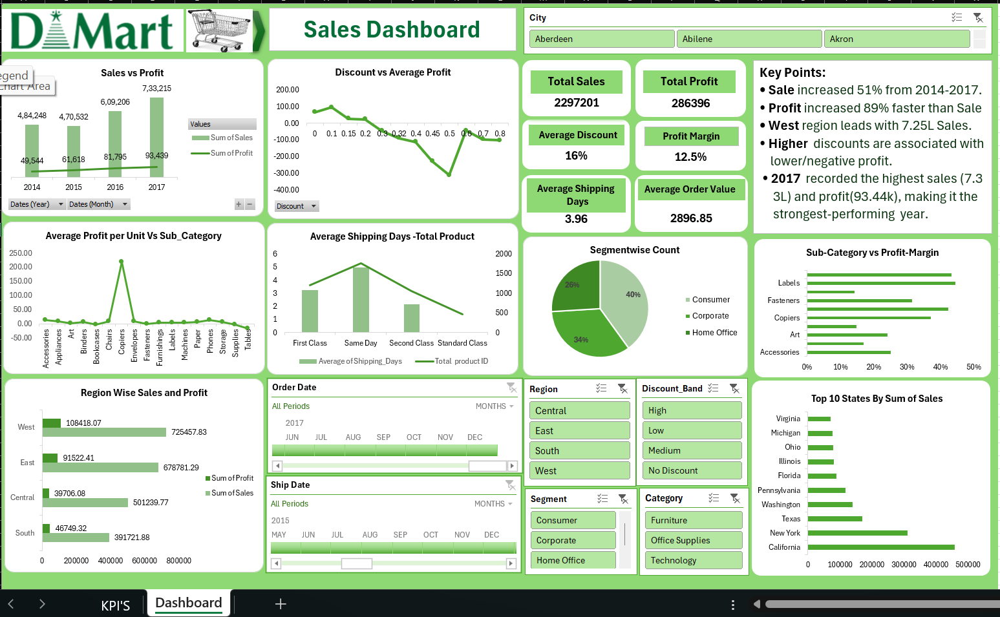

# D-Mart Sales Analysis Excel Dashboard

## Project Overview
This project presents an interactive Sales and Profit Analysis Dashboard created using Microsoft Excel.

The dashboard analyzes sales performance, profitability, discounts, customer segments, regions, product categories, sub-categories, shipping performance, and state-wise sales.

The objective of this project is to transform raw sales data into meaningful business insights using Excel's data analysis and visualization features.

## Tools & Technologies
- Microsoft Excel
- Pivot Tables
- Pivot Charts
- Slicers
- KPI Cards
- Conditional Formatting
- Data Cleaning
- Dashboard Design

## Dashboard KPIs
The dashboard includes the following key performance indicators:
- Total Sales
- Total Profit
- Average Discount
- Profit Margin
- Average Shipping Days
- Average Order Value

## Key Analysis
The dashboard provides analysis of:
- Sales vs Profit by Year
- Discount vs Average Profit
- Average Profit per Unit by Sub-Category
- Average Shipping Days by Ship Mode
- Customer Segment Distribution
- Sub-Category Profit Margin
- Region-wise Sales and Profit
- Top 10 States by Sales
- Category-wise performance
- Discount Band analysis
- Monthly and yearly trends

## Interactive Features
Users can interact with the dashboard using:
- City
- Region
- Discount Band
- Segment
- Category
- Order Date
- Ship Date

These filters allow users to explore the data from different business perspectives.

## Key Insights
- Sales increased significantly between 2014 and 2017.
- Profit also showed an increasing trend during the analyzed period.
- The West region recorded the highest sales among the regions.
- Different discount levels showed different relationships with profitability.
- 2017 recorded the highest annual sales and profit in the dashboard analysis.
- Consumer was the largest customer segment by count.
  
## 📁 Project Files
- [Dmart_Data.xlsx](Dmart_Data.xlsx) – Excel dataset and dashboard
- [Dmart_sales_View.png](Dmart_sales_View.png) – Dashboard preview
  
## Skills Demonstrated
- Data Cleaning
- Data Analysis
- Excel Dashboard Development
- Pivot Tables
- Pivot Charts
- KPI Development
- Data Visualization
- Business Insights
- Interactive Reporting

## Dashboard Preview

## Conclusion
This project demonstrates how Microsoft Excel can be used to convert sales data into an interactive business intelligence dashboard and generate actionable insights for sales and profitability analysis.

##Author

**Rishabh Soni**
